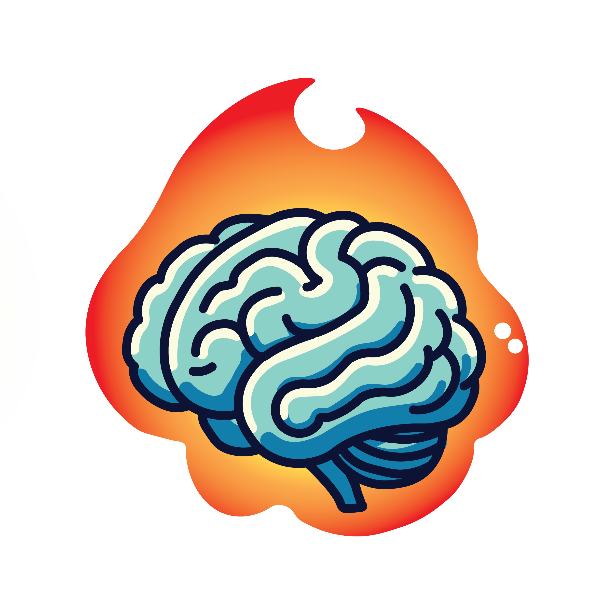

<p align="left">
    
</p>

[Documentation](https://torch-brain.readthedocs.io/en/latest/) | [Paper](https://papers.nips.cc/paper_files/paper/2023/hash/8ca113d122584f12a6727341aaf58887-Abstract-Conference.html)

<!-- [](https://badge.fury.io/py/torch_brain) -->
[](https://torch-brain.readthedocs.io/en/latest/?badge=latest)
[](https://github.com/neuro-galaxy/torch_brain/actions/workflows/testing.yml)
[](https://github.com/neuro-galaxy/torch_brain/actions/workflows/linting.yml)


**torch_brain** is a Python library for various deep learning models designed for neuroscience.

### Features
+ Multi-recording training
+ Optimized data loading with with on-demand data access -- only loads data when needed
+ Advanced samplers that enable arbitrary slicing of data on the fly
+ Advanced data collation strategies including chaining and padding
+ Support for arbitrary neural and behavioral modalities
+ Collection of useful nn.Modules like stitchers, multi-output readouts, infinite vocab embeddings, etc.
+ Collection of neural and behavioral transforms and augmentation strategies
+ Implementations of various deep learning models for neuroscience

### List of implemented models

+ [POYO: A Unified, Scalable Framework for Neural Population Decoding (Azabou et al. 2023)](examples/poyo)
+ More coming soon...


## Installation
torch_brain is available for Python 3.9 to Python 3.11

To install the package, run the following command:
```bash
pip install -e .
```

## Contributing
If you are planning to contribute to the package, you can install the package in
development mode by running the following command:
```bash
pip install -e ".[dev]"
```

Install pre-commit hooks:
```bash
pre-commit install
```

Unit tests are located under test/. Run the entire test suite with
```bash
pytest
```
or test individual files via, e.g., `pytest test/test_binning.py`


## Cite

Please cite [our paper](https://papers.nips.cc/paper_files/paper/2023/hash/8ca113d122584f12a6727341aaf58887-Abstract-Conference.html) if you use this code in your own work:

```bibtex
@inproceedings{
    azabou2023unified,
    title={A Unified, Scalable Framework for Neural Population Decoding},
    author={Mehdi Azabou and Vinam Arora and Venkataramana Ganesh and Ximeng Mao and Santosh Nachimuthu and Michael Mendelson and Blake Richards and Matthew Perich and Guillaume Lajoie and Eva L. Dyer},
    booktitle={Thirty-seventh Conference on Neural Information Processing Systems},
    year={2023},
}
```